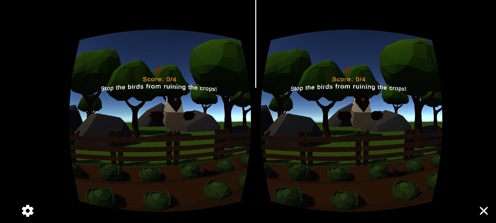

# HelloCardboard: Tomato Toss Game
By Lili Enseling
## Description
Play as a scarecrow and defend your garden from hungry birds! Look around you and throw tomatoes at birds to scare them off.

This is a game because it is a closed, formal system and it has a goal: remove all the birds from your garden to win the game. The idea is that you are playing as a scarecrow on a garden, whose duty is to protect the garden from birds. It has rules, when you throw a tomato and hit a bird your score increases. There is also a 30 second timer to add extra challenge. There are 4 birds so when you get 4 points, you win! If you don't find all the birds and hit them in time, you lose. The interactive part is when the user taps the screen they throw a ball. Furthermore because this game is designed for VR, I wanted to use that as a mechanic so that the player has to look around them to locate the birds. The challenge is to find the birds and hit all of them within 30 seconds.

This game was inspired by the demo game of throwing a ball at a target that I created first, but I thought it would be fun to incorporate a story and environment.

## Assets
- Sound effects: https://assetstore.unity.com/packages/audio/sound-fx/free-casual-game-sfx-pack-54116
- Music: https://assetstore.unity.com/packages/audio/music/casual-game-bgm-5-135943
- Bird asset: https://assetstore.unity.com/packages/3d/characters/animals/quirky-series-free-animals-pack-178235
- Environment and tomato assets: https://assetstore.unity.com/packages/3d/environments/industrial/low-poly-farm-pack-lite-188100
 

